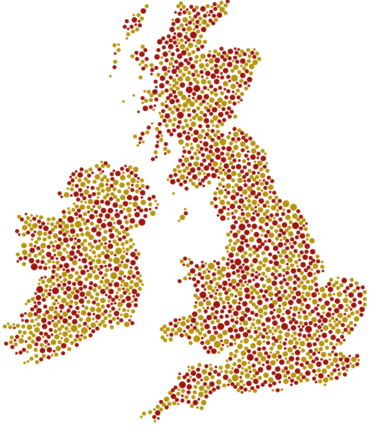

# circle-packing
Packing circles into arbitrary shapes since 2019.

See https://scipython.com/blog/packing-circles-inside-a-shape/ for more information.

Provide a shape in the form of a png image (shape to fill in black; background in white). Customize the image with the initialization arguments to the `Circle` class.

Run with simply:

    python shapefill.py

